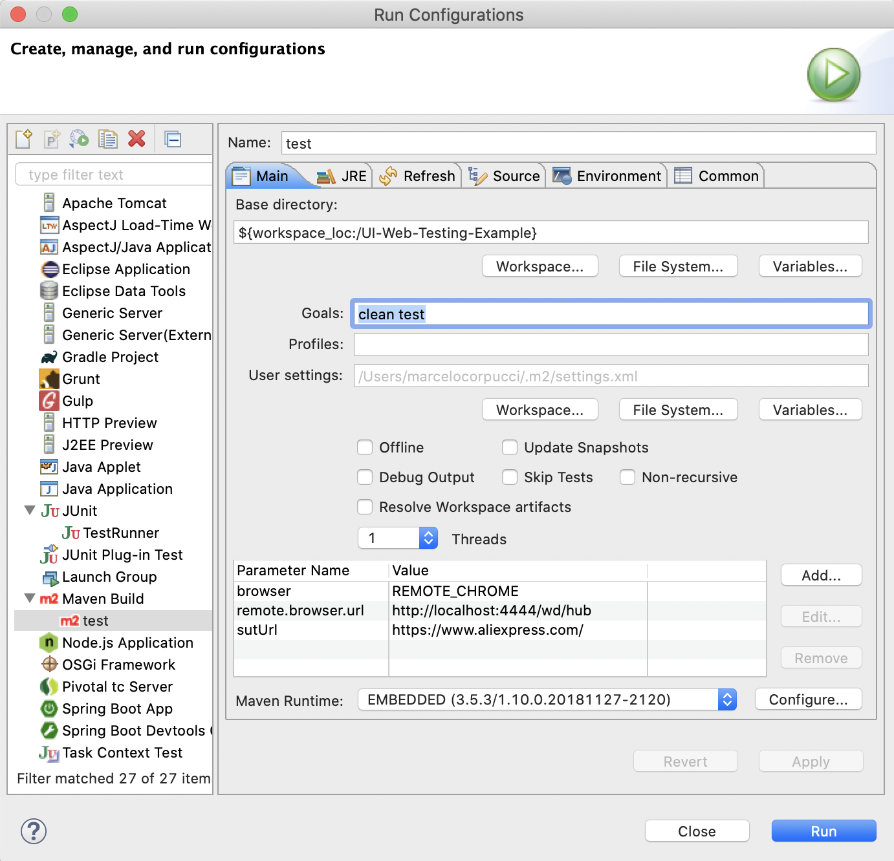
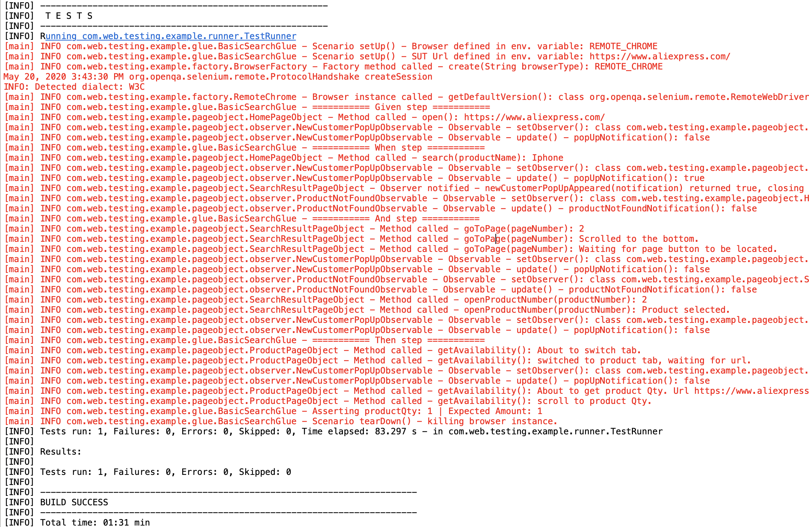

# UI Web Testing Example

This project is intended to group several well known java libraries to create a proof of concept of a test automation framework.
Also, its code structure follows several good practices and design patterns. For more details refer to the following sections.


### Prerequisites

Given this framework is orchestrated by [Apache Maven](https://maven.apache.org/), you need to install it follow the 
[official instructions](https://maven.apache.org/guides/getting-started/maven-in-five-minutes.html). 

Another alternative you can use is the maven instance embedded in the IDE of your choice, such as Eclipse.

In case you want to run this framework using RemoteWebDriver or if you want to take advantage of the reporting capabilities
included in here, [Docker](https://www.docker.com/get-started) needs to be installed.

If you want to run the framework on a local browser, currently the one supported out of the box is Chrome. You will
need the latest browser version and the latest [ChromeDriver](https://chromedriver.chromium.org/downloads) installed. Bear in mind 
the folder on which you want to store this last one, because you will need to reference that path to the framework. 
See Running test for a more detailed description.


### Installing

Clone the repository
```
$ git clone https://github.com/MarceloCorpucci/UI-Web-Testing-Example.git
```

If you want to use a remote browse, which is headless and does not require any further installation on your host
```
$ docker-compose up
```

As you may notice, the docker-compose file also includes a container with Allure Reporting. So you can see some nice and
clean execution overview, apart from the info exposed by the framework logger in the command line output.


### Running the tests

Once we have the code available in your machine and Docker Compose loaded the containers, you need to run the tests defining 
the variables according to the way mentioned above.

To run the tests in a local Chrome browser:
```
$ mvn clean test -Dbrowser=CHROME -Dwebdriver.chrome.driver=/path/to/Chromedriver/chromedriver -DsutUrl=https://www.aliexpress.com/
```

Where the env variables are:
* browser: The browser installed locally.
* webdriver.chrome.driver: Required by WebDriver to connect the test cases to the System Under Test.
* sutUrl: The System under test URL.

To run the tests using a remote browser:
```
$ mvn clean test -Dbrowser=REMOTE_CHROME -Dremote.browser.url=http://localhost:4444/wd/hub -DsutUrl=https://www.aliexpress.com/
```

The difference in the variables are:
* webdriver.chrome.driver: The URL to the RemoteDriver in the Docker container.

To Run the tests from the embedded maven in the IDE:
* Go to Run / Run Configurations / Maven Build / New Configutarion.
* Define a config name, then press Workspace button for Base Directory, test goal and finally add the env variables according to your needs.




### Screenshots



## Built With
This implementation has been built with the toolset below:

* [Docker](https://www.docker.com/get-started)
* [Cucumber JVM](https://cucumber.io/tools/cucumber-open/)
* [WebDriver](https://www.selenium.dev/)
* [JUnit](https://junit.org/junit5/)
* [Hamcrest](http://hamcrest.org/JavaHamcrest/)
* [Allure](http://allure.qatools.ru/)
